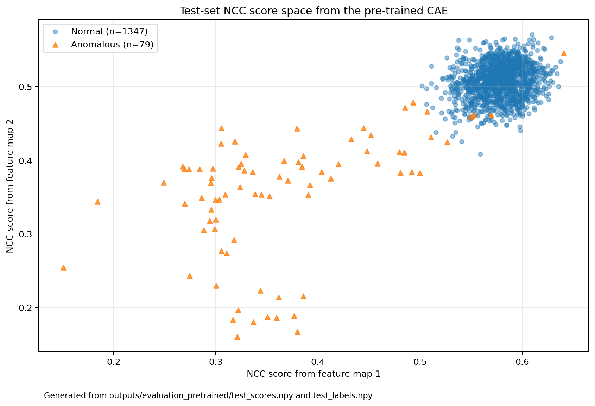
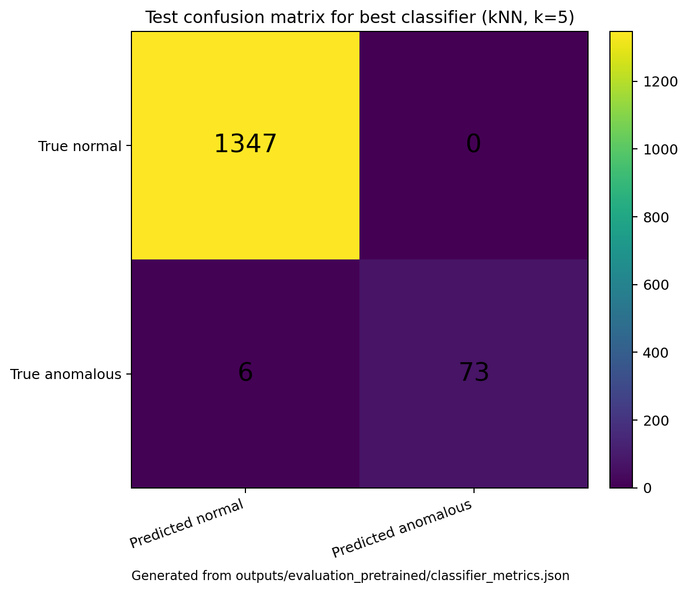

# Audio Anomaly Detection for Large-Scale Structural Testing

[](https://github.com/sergioald/audio-anomaly-detection-structural-testing/actions/workflows/tests.yml)
[](pyproject.toml)
[](LICENSE)

Research-software workflow for **audio-based anomaly detection in large-scale structural testing**.

The project uses **Wavelet Scattering Transform (WST)** feature arrays, a **convolutional autoencoder (CAE)**, hidden-layer **feature-map similarity**, **normalised cross-correlation (NCC)** scores, and lightweight classifiers to distinguish normal and anomalous structural-test behaviour.

<p align="center">
  
</p>

<p align="center">
  <em>End-to-end workflow: WST features are passed through a convolutional autoencoder, compared with normal reference feature maps using NCC, and classified as normal or anomalous.</em>
</p>

This repository accompanies the paper:

> Munko, M. J., Cuthill, F., Valdivia Camacho, M. A., Ó Bradaigh, C. M., & Lopez Dubon, S. (2025). *An audio-based framework for anomaly detection in large-scale structural testing*. Engineering Applications of Artificial Intelligence, 142, 109889. https://doi.org/10.1016/j.engappai.2024.109889

The public processed dataset is hosted on Zenodo:

> Munko, M., Lopez Dubon, S., & Cuthill, F. (2024). *Normal and anomalous audio data processed with the wavelet scattering transform, collected during the operation of FastBlade, a site for regenerative fatigue testing*. Zenodo. https://doi.org/10.5281/zenodo.14298279

---

## Why this project exists

Large-scale structural testing facilities can benefit from low-cost, non-specific sensing. Microphones can capture changes in system behaviour without requiring detailed instrumentation on every component.

This repository turns the research workflow into an inspectable and reusable Python implementation. It is designed to show:

- applied anomaly detection for engineering test data;
- reproducible processing of public WST feature arrays;
- CAE-based feature-map extraction;
- NCC-based similarity scoring against normal-operation reference maps;
- lightweight classifier comparison;
- a clear boundary between public data and confidential facility data.

---

## Quick reproduction path

The fastest way to run the project is to use the public Zenodo WST arrays and the included pre-trained CAE model:

```text
models/pretrained_cae_wst_latent24_structural_audio.h5
```

<p align="center">
  
</p>

<p align="center">
  <em>The reviewer path downloads the public WST arrays, validates the dataset contract, loads the pre-trained CAE, extracts feature-map NCC scores, and evaluates the downstream classifier.</em>
</p>

### 1. Create an environment

```bash
python -m venv .venv
source .venv/bin/activate
python -m pip install --upgrade pip
python -m pip install -e ".[dev,deep-learning]"
```

On Windows PowerShell:

```powershell
python -m venv .venv
.\.venv\Scripts\Activate.ps1
python -m pip install --upgrade pip
python -m pip install -e ".[dev,deep-learning]"
```

> **TensorFlow/Keras compatibility note:** the included pre-trained model is a legacy `.h5` file. Use TensorFlow/Keras versions that can load this model, for example TensorFlow `2.15.x`. If you see an error such as `Unrecognized keyword arguments passed to Conv2DTranspose: {'groups': 1}`, install a TensorFlow version below `2.16`.

### 2. Download and validate the dataset

```bash
python scripts/download_data.py --output data
python scripts/check_dataset.py --data-dir data --strict
```

The dataset is large and is not committed to this repository.

### 3. Run the pre-trained evaluation

Bash, Git Bash, macOS, Linux, or WSL:

```bash
python scripts/evaluate_feature_map_classifier.py \
  --data-dir data \
  --model models/pretrained_cae_wst_latent24_structural_audio.h5 \
  --output-dir outputs/evaluation_pretrained
```

Windows PowerShell:

```powershell
python scripts/evaluate_feature_map_classifier.py `
  --data-dir data `
  --model models/pretrained_cae_wst_latent24_structural_audio.h5 `
  --output-dir outputs/evaluation_pretrained
```

Or as one line:

```powershell
python scripts/evaluate_feature_map_classifier.py --data-dir data --model models/pretrained_cae_wst_latent24_structural_audio.h5 --output-dir outputs/evaluation_pretrained
```

Expected outputs:

```text
outputs/evaluation_pretrained/classifier_metrics.json
outputs/evaluation_pretrained/reference_maps.npz
outputs/evaluation_pretrained/best_classifier.joblib
outputs/evaluation_pretrained/validation_scores.npy
outputs/evaluation_pretrained/test_scores.npy
```

---

## Example result from the pre-trained workflow

<p align="center">
  
</p>

<p align="center">
  <em>Real test-set NCC scores generated with the included pre-trained CAE workflow. Each point is one test sample represented by the selected feature-map NCC scores used by the downstream classifier.</em>
</p>

The uploaded run associated with this README produced the following best-classifier result for the test set:

| Classifier | Accuracy | Normal recall | Anomalous recall |
|---|---:|---:|---:|
| kNN, k=5 | 99.58% | 100.00% | 92.41% |

<p align="center">
  
</p>

<p align="center">
  <em>Confusion matrix from the pre-trained feature-map/NCC workflow using the selected kNN classifier.</em>
</p>

---

## Method summary

The method uses precomputed audio-derived WST arrays as the input representation. A convolutional autoencoder is trained on normal-operation data. Instead of relying only on reconstruction error, the workflow extracts hidden-layer feature maps and compares them with averaged normal reference maps.

<p align="center">
  
</p>

<p align="center">
  <em>Conceptual illustration of NCC comparison between sample CAE feature maps and normal reference feature maps.</em>
</p>

The resulting NCC scores form a compact feature space for downstream classifiers, including k-nearest neighbours, logistic regression, support vector machines, and decision trees.

---

## Reported reference performance

<p align="center">
  
</p>

<p align="center">
  <em>Reference performance reported in the companion paper. This figure summarises paper-reported results, not a newly generated benchmark.</em>
</p>

Exact results may vary depending on TensorFlow/Keras version, hardware, model format, and retraining choices.

---

## Supported workflows

| Workflow | Input | Model | Purpose |
|---|---|---|---|
| A. Quick reproduction | Public Zenodo WST `.npy` files | Included pre-trained CAE | Fastest path from public data to classifier output |
| B. Full reproduction | Public Zenodo WST `.npy` files | Retrained CAE | Reproduce the neural-network training path |
| C. New raw audio | User-provided `.wav` files | Pre-trained or retrained CAE | Apply the workflow to new local audio |

### Workflow A: quick reproduction

```bash
python scripts/download_data.py --output data
python scripts/check_dataset.py --data-dir data --strict
python scripts/evaluate_feature_map_classifier.py --data-dir data --output-dir outputs/evaluation_pretrained
```

The `--model` argument is optional because the included pre-trained CAE is the default model path.

### Workflow B: train the CAE from scratch

```bash
python scripts/download_data.py --output data
python scripts/check_dataset.py --data-dir data --strict

python scripts/train_cae.py \
  --data-dir data \
  --output-model models/cae_wst_latent24_retrained.keras \
  --epochs 100

python scripts/evaluate_feature_map_classifier.py \
  --data-dir data \
  --model models/cae_wst_latent24_retrained.keras \
  --output-dir outputs/evaluation_retrained
```

Retraining can take substantially longer than using the pre-trained model and can produce slightly different results.

### Workflow C: use new raw audio

For local `.wav` files, install the WST dependencies and create feature arrays:

```bash
python -m pip install -e ".[wst,deep-learning]"

python scripts/prepare_new_audio.py \
  --audio-dir new_audio \
  --output-features outputs/new_audio/features.npy \
  --output-windows outputs/new_audio/windows.csv
```

Then predict with an existing trained pipeline:

```bash
python scripts/predict_new_audio.py \
  --features outputs/new_audio/features.npy \
  --model models/pretrained_cae_wst_latent24_structural_audio.h5 \
  --classifier outputs/evaluation_pretrained/best_classifier.joblib \
  --reference-maps outputs/evaluation_pretrained/reference_maps.npz \
  --output-dir outputs/new_audio_predictions
```

For a complete labelled raw-audio dataset, see [`docs/new_data_workflow.md`](docs/new_data_workflow.md).

---

## Dataset contract

The public Zenodo WST dataset should be placed in `data/` with these filenames:

| File | Role |
|---|---|
| `Normal_Data_Training.npy` | Normal data used to train the CAE and compute reference maps |
| `Normal_Data_Validation.npy` | Normal validation data for classifier tuning |
| `Anomalous_Data_Validation.npy` | Anomalous validation data for classifier tuning |
| `Normal_Data_Test.npy` | Normal held-out test data |
| `Anomalous_Data_Test.npy` | Anomalous held-out test data |

Use the helper script to download them:

```bash
python scripts/download_data.py --output data
```

Then validate the local files:

```bash
python scripts/check_dataset.py --data-dir data --strict
```

---

## Repository structure

```text
audio-anomaly-detection-structural-testing/
  README.md
  pyproject.toml
  CITATION.cff
  LICENSE
  configs/
    default.yaml
  docs/
    assets/
      readme_method_pipeline.png
      readme_quick_reproduction.png
      readme_ncc_concept.png
      readme_reported_metrics.png
      readme_test_ncc_score_space.png
      readme_test_confusion_matrix_knn5.png
    dataset.md
    paper_summary.md
    method_notes.md
    reproducibility.md
    new_data_workflow.md
    confidentiality_statement.md
  models/
    pretrained_cae_wst_latent24_structural_audio.h5
  scripts/
    download_data.py
    check_dataset.py
    train_cae.py
    evaluate_feature_map_classifier.py
    evaluate_reconstruction_baselines.py
    prepare_new_audio.py
    prepare_raw_audio_dataset.py
    predict_new_audio.py
    benchmark_inference.py
    inspect_h5_model.py
  src/audio_anomaly/
    audio.py
    data.py
    model.py
    feature_maps.py
    metrics.py
    classifiers.py
    evaluation.py
    plotting.py
  tests/
```

---

## Tests

Run the unit tests with:

```bash
pytest
```

The test suite uses small synthetic arrays. It does not download the large Zenodo dataset and does not require TensorFlow for the core CI path.

---

## Documentation

Supporting documents:

- [`docs/dataset.md`](docs/dataset.md) — dataset contract and expected files
- [`docs/paper_summary.md`](docs/paper_summary.md) — companion paper summary
- [`docs/method_notes.md`](docs/method_notes.md) — implementation notes
- [`docs/reproducibility.md`](docs/reproducibility.md) — reproduction commands
- [`docs/new_data_workflow.md`](docs/new_data_workflow.md) — using new raw audio
- [`docs/confidentiality_statement.md`](docs/confidentiality_statement.md) — public/private data boundary

---

## Confidentiality and data boundary

This repository does **not** contain raw FastBlade audio, private facility data, confidential operational records, or proprietary control logic.

It is designed to work with:

1. the public processed WST dataset hosted on Zenodo; and
2. user-provided local audio files.

See [`docs/confidentiality_statement.md`](docs/confidentiality_statement.md) for details.

---

## Citation

If you use this repository, please cite the software repository, the companion paper, and the Zenodo dataset.

```bibtex
@article{munko2025audio,
  title = {An audio-based framework for anomaly detection in large-scale structural testing},
  author = {Munko, Marek J. and Cuthill, Fergus and Valdivia Camacho, Miguel A. and {\'{O}} Bradaigh, Conch\'{u}r M. and Lopez Dubon, Sergio},
  journal = {Engineering Applications of Artificial Intelligence},
  volume = {142},
  pages = {109889},
  year = {2025},
  doi = {10.1016/j.engappai.2024.109889}
}
```

```bibtex
@dataset{munko2024wst,
  title = {Normal and anomalous audio data processed with the wavelet scattering transform, collected during the operation of FastBlade, a site for regenerative fatigue testing},
  author = {Munko, Marek and Lopez Dubon, Sergio and Cuthill, Fergus},
  year = {2024},
  publisher = {Zenodo},
  doi = {10.5281/zenodo.14298279}
}
```

See [`CITATION.cff`](CITATION.cff) for citation metadata.

---

## License

The code in this repository is released under the MIT License. See [`LICENSE`](LICENSE).

The Zenodo dataset has its own license and citation requirements. Cite the dataset and companion paper when using this workflow.
