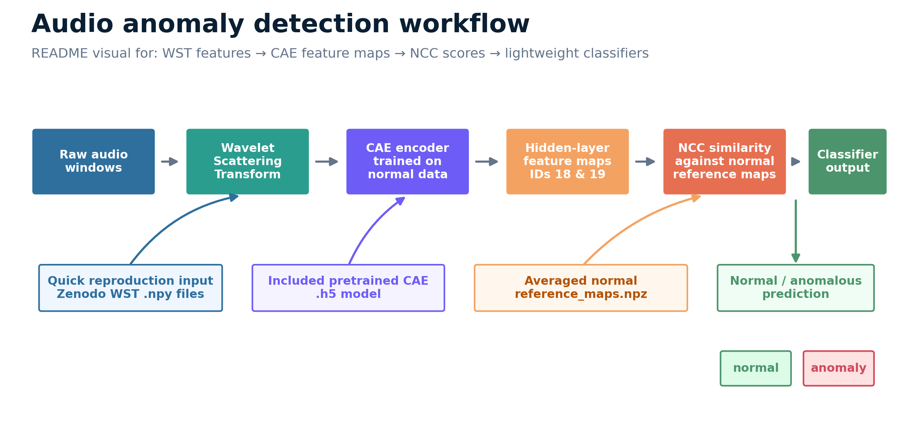
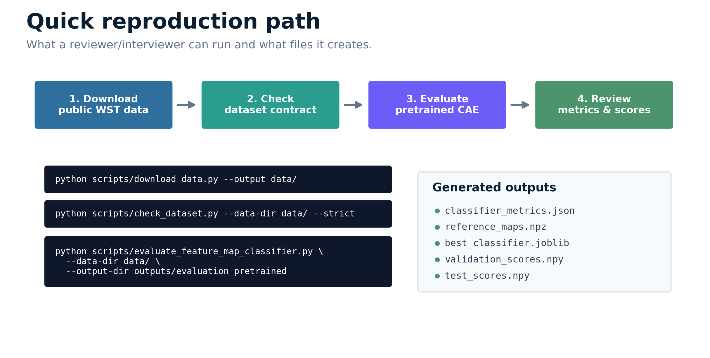
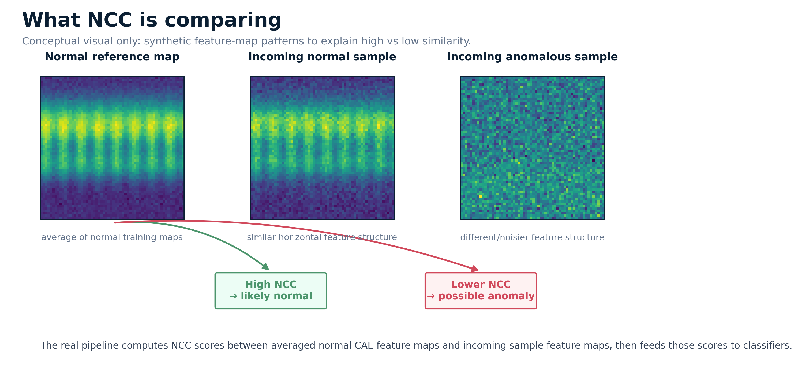
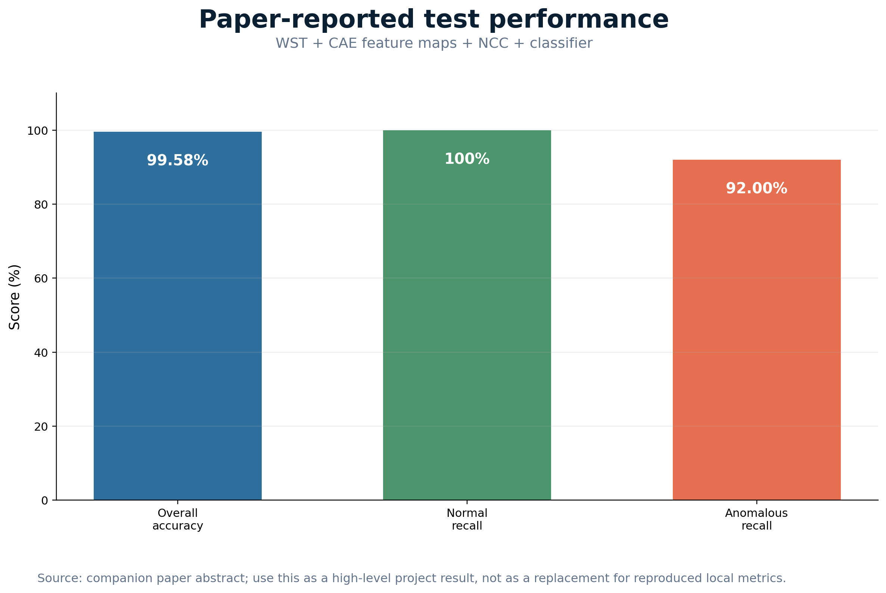
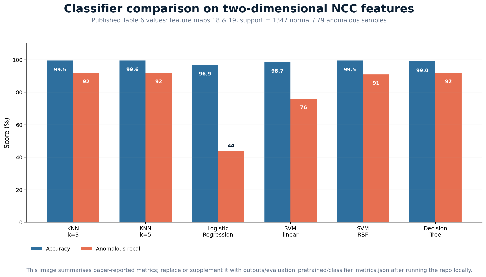

# Audio Anomaly Detection for Large-Scale Structural Testing

[](https://github.com/sergioald/audio-anomaly-detection-structural-testing/actions/workflows/tests.yml)
[](pyproject.toml)
[](LICENSE)

Reproducible Python workflow for **audio-based anomaly detection in large-scale structural testing** using Wavelet Scattering Transform (WST) features, convolutional autoencoder (CAE) feature maps, normalised cross-correlation (NCC), and lightweight classifiers.

<p align="center">
  
</p>

<p align="center">
  <em>End-to-end workflow: WST feature arrays are passed through a convolutional autoencoder, converted into feature-map similarities using NCC, and classified as normal or anomalous.</em>
</p>

This repository is prepared as a public research-software companion to:

> Munko, M. J., Cuthill, F., Valdivia Camacho, M. A., Ó Bradaigh, C. M., & Lopez Dubon, S. (2025). *An audio-based framework for anomaly detection in large-scale structural testing*. Engineering Applications of Artificial Intelligence, 142, 109889. https://doi.org/10.1016/j.engappai.2024.109889

The public dataset is hosted externally on Zenodo:

> Munko, M., Lopez Dubon, S., & Cuthill, F. (2024). *Normal and anomalous audio data processed with the wavelet scattering transform, collected during the operation of FastBlade, a site for regenerative fatigue testing*. Zenodo. https://doi.org/10.5281/zenodo.14298279

---

## Why this project exists

Large-scale structural testing facilities can benefit from low-cost, non-specific sensing for anomaly detection. Microphones can capture system-wide changes without requiring detailed instrumentation for every component or subsystem.

This repository turns the original research workflow into a cleaner public implementation that can be inspected, tested, and reused:

```text
WST feature arrays
→ convolutional autoencoder (CAE)
→ hidden-layer feature maps
→ averaged normal reference maps
→ normalised cross-correlation (NCC)
→ classifier-based anomaly detection
```

The goal is not only to share code, but also to show a reproducible research-software workflow for engineering data, anomaly detection, and scientific machine learning.

---

## What this repository demonstrates

- Applied anomaly detection for structural testing data
- Audio-derived WST feature processing
- CAE-based feature-map extraction
- NCC scoring against normal-operation reference maps
- Lightweight classifier comparison
- Reproducible command-line workflows
- Public dataset boundary and confidentiality separation
- Unit tests that run without downloading the large dataset

---

## Supported workflows

| Workflow | Data input | Model option | Purpose |
|---|---|---|---|
| A. Quick reproduction | Public Zenodo WST `.npy` files | Included pre-trained CAE | Fastest reviewer path |
| B. Full reproduction | Public Zenodo WST `.npy` files | Train CAE from scratch | Reproducibility path |
| C. New raw audio | User-provided `.wav` files | Pre-trained or retrained CAE | Advanced extension path |

The Zenodo arrays are downloaded locally. This repository includes one small pre-trained CAE model at:

```text
models/pretrained_cae_wst_latent24_structural_audio.h5
```

That means the quick reproduction workflow can be run without first training a neural network.

---

## Quick start

### 1. Create an environment

```bash
python -m venv .venv
source .venv/bin/activate
python -m pip install --upgrade pip
python -m pip install -e ".[dev]"
```

On Windows PowerShell:

```powershell
python -m venv .venv
.\.venv\Scripts\Activate.ps1
python -m pip install --upgrade pip
python -m pip install -e ".[dev]"
```

For deep-learning workflows:

```bash
python -m pip install -e ".[deep-learning]"
```

For raw-audio-to-WST workflows:

```bash
python -m pip install -e ".[wst]"
```

For everything:

```bash
python -m pip install -e ".[dev,deep-learning,wst]"
```

> **Windows note:** use a short path such as `C:\Test\dth` to avoid TensorFlow path-length issues.

### 2. Download and validate the public WST data

```bash
python scripts/download_data.py --output data/
python scripts/check_dataset.py --data-dir data/ --strict
```

### 3. Run the pre-trained feature-map/NCC classifier workflow

```bash
python scripts/evaluate_feature_map_classifier.py \
  --data-dir data/ \
  --model models/pretrained_cae_wst_latent24_structural_audio.h5 \
  --output-dir outputs/evaluation_pretrained
```

The `--model` argument can be omitted because this is the default pre-trained model path.

This writes:

```text
outputs/evaluation_pretrained/classifier_metrics.json
outputs/evaluation_pretrained/reference_maps.npz
outputs/evaluation_pretrained/best_classifier.joblib
outputs/evaluation_pretrained/validation_scores.npy
outputs/evaluation_pretrained/test_scores.npy
```

<p align="center">
  
</p>

<p align="center">
  <em>The fastest reviewer path uses the public Zenodo WST arrays and the included pre-trained CAE model to reproduce the feature-map/NCC classifier workflow.</em>
</p>

---

## Method overview

The method uses audio-derived WST arrays as the input representation. A convolutional autoencoder is trained on normal-operation data. Instead of using only reconstruction error, the workflow extracts hidden-layer feature maps and compares them with averaged normal reference maps using normalised cross-correlation.

<p align="center">
  
</p>

<p align="center">
  <em>Conceptual illustration of how NCC compares CAE feature maps against averaged normal reference maps.</em>
</p>

The resulting NCC scores are used as compact features for candidate classifiers, including KNN, logistic regression, SVM, and decision tree models.

---

## Reported reference performance

<p align="center">
  
</p>

<p align="center">
  <em>Reference performance reported in the companion paper. This figure summarises paper-reported metrics, not a newly generated benchmark run.</em>
</p>

The repository is intended to make the workflow easier to inspect and reproduce. Exact results may vary depending on environment, TensorFlow version, model format, and retraining choices.

<p align="center">
  
</p>

<p align="center">
  <em>Summary visual for the classifier comparison used in the paper-style workflow.</em>
</p>

---

## Workflow A: quick reproduction with the included pre-trained CAE

Use this workflow when you want the fastest path from public data to anomaly-detection outputs.

```bash
python scripts/download_data.py --output data/
python scripts/check_dataset.py --data-dir data/ --strict

python scripts/evaluate_feature_map_classifier.py \
  --data-dir data/ \
  --model models/pretrained_cae_wst_latent24_structural_audio.h5 \
  --output-dir outputs/evaluation_pretrained
```

Expected output directory:

```text
outputs/evaluation_pretrained/
```

Typical output files:

| File | Purpose |
|---|---|
| `classifier_metrics.json` | Summary metrics for classifier evaluation |
| `reference_maps.npz` | Averaged normal reference feature maps |
| `best_classifier.joblib` | Persisted selected classifier |
| `validation_scores.npy` | NCC-derived validation scores |
| `test_scores.npy` | NCC-derived test scores |

---

## Workflow B: train the CAE from scratch

Use this workflow when you want to retrain the neural network rather than using the included pre-trained model.

```bash
python scripts/download_data.py --output data/
python scripts/check_dataset.py --data-dir data/ --strict

python scripts/train_cae.py \
  --data-dir data/ \
  --output-model models/cae_wst_latent24_retrained.keras \
  --epochs 100

python scripts/evaluate_feature_map_classifier.py \
  --data-dir data/ \
  --model models/cae_wst_latent24_retrained.keras \
  --output-dir outputs/evaluation_retrained
```

Retraining may take substantially longer than Workflow A and may produce slightly different results depending on the machine-learning environment.

---

## Workflow C: use new raw audio

For a folder of new `.wav` files, compute WST features:

```bash
python -m pip install -e ".[wst,deep-learning]"

python scripts/prepare_new_audio.py \
  --audio-dir new_audio/ \
  --output-features outputs/new_audio/features.npy \
  --output-windows outputs/new_audio/windows.csv
```

Predict with an existing trained pipeline:

```bash
python scripts/predict_new_audio.py \
  --features outputs/new_audio/features.npy \
  --model models/pretrained_cae_wst_latent24_structural_audio.h5 \
  --classifier outputs/evaluation_pretrained/best_classifier.joblib \
  --reference-maps outputs/evaluation_pretrained/reference_maps.npz \
  --output-dir outputs/new_audio_predictions
```

For a complete new labelled dataset, organise raw audio as:

```text
new_raw_audio/
  normal_train/
  normal_validation/
  anomalous_validation/
  normal_test/
  anomalous_test/
```

Then create paper-style `.npy` files:

```bash
python scripts/prepare_raw_audio_dataset.py \
  --normal-train-dir new_raw_audio/normal_train \
  --normal-validation-dir new_raw_audio/normal_validation \
  --anomalous-validation-dir new_raw_audio/anomalous_validation \
  --normal-test-dir new_raw_audio/normal_test \
  --anomalous-test-dir new_raw_audio/anomalous_test \
  --output-dir data_new
```

Then run Workflow B using:

```bash
--data-dir data_new
```

See [`docs/new_data_workflow.md`](docs/new_data_workflow.md) for more detail.

---

## Dataset files expected locally

The code expects the following public Zenodo filenames:

| File | Role |
|---|---|
| `Normal_Data_Training.npy` | Normal data used to train the CAE and compute reference feature maps |
| `Normal_Data_Validation.npy` | Normal validation data used to train/tune classifiers |
| `Anomalous_Data_Validation.npy` | Anomalous validation data used to train/tune classifiers |
| `Normal_Data_Test.npy` | Normal held-out test data |
| `Anomalous_Data_Test.npy` | Anomalous held-out test data |

Place them in `data/`, or run:

```bash
python scripts/download_data.py --output data/
```

The large dataset is intentionally not committed to this repository.

---

## Current status

This repository includes:

- public dataset contract for the Zenodo `.npy` files;
- CAE architecture matching the paper appendix;
- included pre-trained CAE model: `models/pretrained_cae_wst_latent24_structural_audio.h5`;
- support for legacy `.h5` models and clean `.keras` models;
- batched feature-map extraction to avoid storing large intermediate arrays;
- NCC scoring for selected feature maps;
- candidate classifiers: KNN, logistic regression, SVM, and decision tree;
- raw `.wav` to WST feature generation for advanced new-data workflows;
- CLI scripts for data checking, training, evaluation, prediction, and benchmarking;
- unit tests using small synthetic arrays, so CI does not download the large dataset;
- documentation for reproducibility, dataset boundaries, model use, and new-data workflows.

---

## Repository structure

```text
audio-anomaly-detection-structural-testing/
  README.md
  pyproject.toml
  CITATION.cff
  LICENSE
  configs/
    default.yaml
  docs/
    assets/
      readme_method_pipeline.png
      readme_ncc_concept.png
      readme_quick_reproduction.png
      readme_reported_metrics.png
      readme_classifier_comparison.png
    dataset.md
    paper_summary.md
    method_notes.md
    reproducibility.md
    new_data_workflow.md
    confidentiality_statement.md
  examples/
  models/
    pretrained_cae_wst_latent24_structural_audio.h5
  scripts/
    download_data.py
    check_dataset.py
    train_cae.py
    evaluate_feature_map_classifier.py
    evaluate_reconstruction_baselines.py
    prepare_new_audio.py
    prepare_raw_audio_dataset.py
    predict_new_audio.py
    benchmark_inference.py
    inspect_h5_model.py
  src/audio_anomaly/
    audio.py
    data.py
    model.py
    feature_maps.py
    metrics.py
    classifiers.py
    evaluation.py
    plotting.py
  tests/
    test_data_contract.py
    test_metrics.py
    test_feature_map_pipeline.py
    test_classifiers.py
    test_audio_windows.py
```

---

## Tests

Run the unit tests with:

```bash
pytest
```

The CI test suite is designed to use small synthetic arrays. It does not download the large public dataset and does not require TensorFlow.

---

## Documentation

Useful supporting documents:

- [`docs/dataset.md`](docs/dataset.md) — dataset contract and expected files
- [`docs/paper_summary.md`](docs/paper_summary.md) — companion paper summary
- [`docs/method_notes.md`](docs/method_notes.md) — method implementation notes
- [`docs/reproducibility.md`](docs/reproducibility.md) — reproducibility commands
- [`docs/new_data_workflow.md`](docs/new_data_workflow.md) — using new raw audio
- [`docs/confidentiality_statement.md`](docs/confidentiality_statement.md) — data boundary and confidentiality statement

---

## Confidentiality and data boundary

This repository does **not** contain raw FastBlade audio, private facility data, confidential operational records, or proprietary control logic.

It is designed to work with:

1. the public processed WST dataset hosted on Zenodo; and
2. user-provided local audio files.

See [`docs/confidentiality_statement.md`](docs/confidentiality_statement.md).

---

## Citation

If you use this repository, please cite the software repository, the companion paper, and the Zenodo dataset.

```bibtex
@article{munko2025audio,
  title = {An audio-based framework for anomaly detection in large-scale structural testing},
  author = {Munko, Marek J. and Cuthill, Fergus and Valdivia Camacho, Miguel A. and {\'{O}} Bradaigh, Conch\'{u}r M. and Lopez Dubon, Sergio},
  journal = {Engineering Applications of Artificial Intelligence},
  volume = {142},
  pages = {109889},
  year = {2025},
  doi = {10.1016/j.engappai.2024.109889}
}
```

```bibtex
@dataset{munko2024wst,
  title = {Normal and anomalous audio data processed with the wavelet scattering transform, collected during the operation of FastBlade, a site for regenerative fatigue testing},
  author = {Munko, Marek and Lopez Dubon, Sergio and Cuthill, Fergus},
  year = {2024},
  publisher = {Zenodo},
  doi = {10.5281/zenodo.14298279}
}
```

See [`CITATION.cff`](CITATION.cff) for citation metadata.

---

## License

MIT License for the code in this repository. See [`LICENSE`](LICENSE).

The Zenodo dataset has its own license and citation requirements. Cite the dataset and the paper when using this repository.
