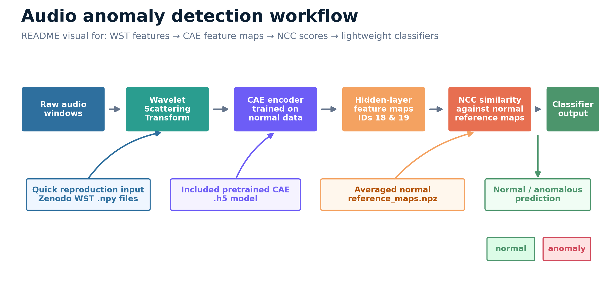
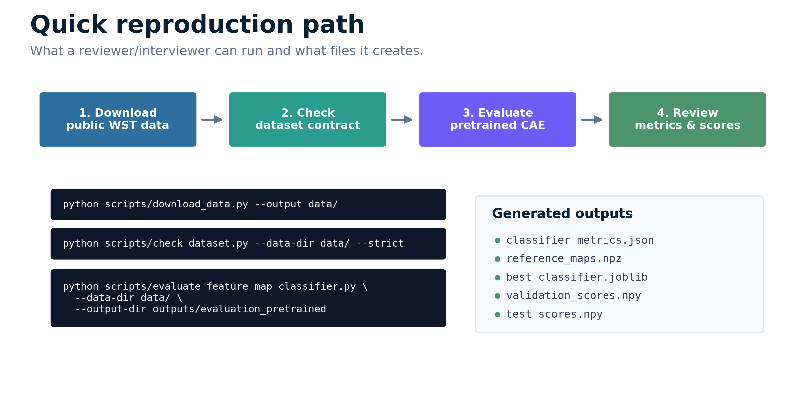
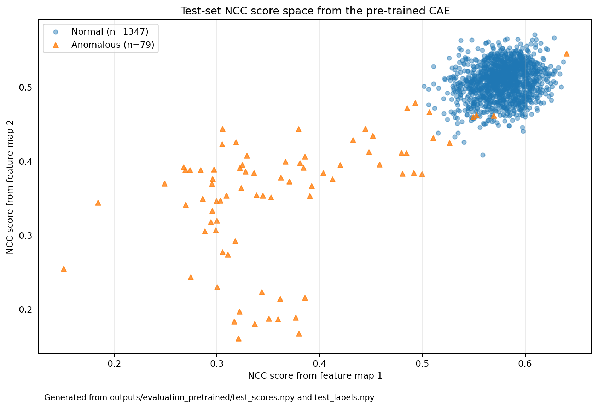

# Audio Anomaly Detection for Large-Scale Structural Testing

[](https://github.com/sergioald/audio-anomaly-detection-structural-testing/actions/workflows/tests.yml)
[](pyproject.toml)
[](.pre-commit-config.yaml)
[](LICENSE)
[](https://doi.org/10.1016/j.engappai.2024.109889)
[](https://doi.org/10.5281/zenodo.14298279)

Research-software workflow for **audio-based anomaly detection in large-scale structural testing**.

This repository turns the companion paper workflow into an inspectable Python implementation. It uses public Wavelet Scattering Transform (WST) feature arrays, a convolutional autoencoder (CAE), hidden-layer feature-map similarity, normalised cross-correlation (NCC), and lightweight classifiers to distinguish normal and anomalous structural-test behaviour.

<p align="center">
  
</p>

<p align="center">
  <em>Method overview: WST features are passed through a CAE, hidden feature maps are compared with normal reference maps using NCC, and the resulting scores are classified as normal or anomalous.</em>
</p>

## Why this project matters

Large-scale structural test facilities generate complex operational signals. Microphones offer a low-cost, non-specific sensing route for detecting behavioural changes without instrumenting every component. This repository demonstrates how audio-derived features can be converted into a reproducible anomaly-detection workflow suitable for research review, portfolio inspection, and reuse on new local audio data.

The project is designed to show:

- applied machine learning for engineering test data;
- reproducible handling of public scientific datasets;
- CAE-based hidden feature-map extraction;
- NCC-based comparison against normal-operation reference maps;
- lightweight classifier evaluation;
- clear separation between public data, reusable code, and confidential facility information;
- tested Python research software with CI, `pytest`, `ruff`, and `pre-commit`.

## Companion paper and dataset

This repository accompanies:

> Munko, M. J., Cuthill, F., Valdivia Camacho, M. A., Ó Bradaigh, C. M., & Lopez Dubon, S. (2025). *An audio-based framework for anomaly detection in large-scale structural testing*. Engineering Applications of Artificial Intelligence, 142, 109889. https://doi.org/10.1016/j.engappai.2024.109889

The public processed dataset is hosted on Zenodo:

> Munko, M., Lopez Dubon, S., & Cuthill, F. (2024). *Normal and anomalous audio data processed with the wavelet scattering transform, collected during the operation of FastBlade, a site for regenerative fatigue testing*. Zenodo. https://doi.org/10.5281/zenodo.14298279

## Quick reproduction path

The fastest path uses the public Zenodo WST arrays and the included pre-trained CAE model:

```text
models/pretrained_cae_wst_latent24_structural_audio.h5
```

<p align="center">
  
</p>

<p align="center">
  <em>Reviewer path: download the public WST arrays, validate the dataset contract, load the pre-trained CAE, compute feature-map NCC scores, and evaluate the downstream classifier.</em>
</p>

### 1. Create an environment

Bash, Git Bash, macOS, Linux, or WSL:

```bash
python -m venv .venv
source .venv/bin/activate
python -m pip install --upgrade pip
python -m pip install -e ".[dev,deep-learning]"
```

Windows PowerShell:

```powershell
python -m venv .venv
.\.venv\Scripts\Activate.ps1
python -m pip install --upgrade pip
python -m pip install -e ".[dev,deep-learning]"
```

> **TensorFlow/Keras compatibility note:** the included pre-trained model is a legacy `.h5` file. Use TensorFlow/Keras versions that can load this model, for example TensorFlow `2.15.x`. If you see an error such as `Unrecognized keyword arguments passed to Conv2DTranspose: {'groups': 1}`, install a TensorFlow version below `2.16`.

### 2. Download and validate the dataset

```bash
python scripts/download_data.py --output data
python scripts/check_dataset.py --data-dir data --strict
```

The dataset is large and is not committed to this repository.

### 3. Run the pre-trained evaluation

```bash
python scripts/evaluate_feature_map_classifier.py \
  --data-dir data \
  --model models/pretrained_cae_wst_latent24_structural_audio.h5 \
  --output-dir outputs/evaluation_pretrained
```

Windows PowerShell line continuation uses backticks:

```powershell
python scripts/evaluate_feature_map_classifier.py `
  --data-dir data `
  --model models/pretrained_cae_wst_latent24_structural_audio.h5 `
  --output-dir outputs/evaluation_pretrained
```

Expected outputs:

```text
outputs/evaluation_pretrained/classifier_metrics.json
outputs/evaluation_pretrained/reference_maps.npz
outputs/evaluation_pretrained/best_classifier.joblib
outputs/evaluation_pretrained/validation_scores.npy
outputs/evaluation_pretrained/test_scores.npy
```

## Example result

<p align="center">
  
</p>

<p align="center">
  <em>Real test-set NCC scores generated with the included pre-trained CAE workflow. Each point is one test sample represented by the selected feature-map NCC scores used by the downstream classifier.</em>
</p>

The run associated with this README produced the following best-classifier result for the test set:

| Classifier | Accuracy | Normal recall | Anomalous recall |
|---|---:|---:|---:|
| kNN, k=5 | 99.58% | 100.00% | 92.41% |

Exact results may vary depending on TensorFlow/Keras version, hardware, model format, and retraining choices.

## Supported workflows

| Workflow | Input | Model | Purpose |
|---|---|---|---|
| A. Quick reproduction | Public Zenodo WST `.npy` files | Included pre-trained CAE | Fastest public-data path |
| B. Full reproduction | Public Zenodo WST `.npy` files | Retrained CAE | Reproduce the neural-network training path |
| C. New raw audio | User-provided `.wav` files | Pre-trained or retrained CAE | Apply the workflow to new local audio |

### Workflow A: quick reproduction

```bash
python scripts/download_data.py --output data
python scripts/check_dataset.py --data-dir data --strict
python scripts/evaluate_feature_map_classifier.py --data-dir data --output-dir outputs/evaluation_pretrained
```

### Workflow B: train the CAE from scratch

```bash
python scripts/download_data.py --output data
python scripts/check_dataset.py --data-dir data --strict

python scripts/train_cae.py \
  --data-dir data \
  --output-model models/cae_wst_latent24_retrained.keras \
  --epochs 100

python scripts/evaluate_feature_map_classifier.py \
  --data-dir data \
  --model models/cae_wst_latent24_retrained.keras \
  --output-dir outputs/evaluation_retrained
```

Retraining can take substantially longer than using the pre-trained model and can produce slightly different results.

### Workflow C: use new raw audio

For local `.wav` files, install the WST dependencies and create feature arrays:

```bash
python -m pip install -e ".[wst,deep-learning]"

python scripts/prepare_new_audio.py \
  --audio-dir new_audio \
  --output-features outputs/new_audio/features.npy \
  --output-windows outputs/new_audio/windows.csv
```

Then predict with an existing trained pipeline:

```bash
python scripts/predict_new_audio.py \
  --features outputs/new_audio/features.npy \
  --model models/pretrained_cae_wst_latent24_structural_audio.h5 \
  --classifier outputs/evaluation_pretrained/best_classifier.joblib \
  --reference-maps outputs/evaluation_pretrained/reference_maps.npz \
  --output-dir outputs/new_audio_predictions
```

For a complete labelled raw-audio dataset, see [`docs/new_data_workflow.md`](docs/new_data_workflow.md).

## Testing and quality checks

The repository includes lightweight unit, smoke, and synthetic integration tests. The core CI path uses small synthetic arrays and does not download the full Zenodo dataset, train the CAE, or require TensorFlow/Keras.

Run locally:

```bash
python -m pip install -e ".[dev]"
pre-commit run --all-files
pytest
```

The test and quality layer checks:

- dataset-contract utilities and shape handling;
- NCC, error metrics, PSNR, and histogram-overlap behaviour;
- TensorFlow-free feature-map scoring helpers;
- classifier training, evaluation, selection, and save/load behaviour;
- raw-audio helper utilities that do not require optional WST dependencies;
- a synthetic end-to-end feature-map/classifier integration path;
- selected script smoke-test behaviour;
- formatting and linting through `ruff` and `pre-commit`.

See [`docs/scientific_validation.md`](docs/scientific_validation.md) for what the tests do and do **not** prove scientifically.

## Dataset contract

The public Zenodo WST dataset should be placed in `data/` with these filenames:

| File | Role |
|---|---|
| `Normal_Data_Training.npy` | Normal data used to train the CAE and compute reference maps |
| `Normal_Data_Validation.npy` | Normal validation data for classifier tuning |
| `Anomalous_Data_Validation.npy` | Anomalous validation data for classifier tuning |
| `Normal_Data_Test.npy` | Normal held-out test data |
| `Anomalous_Data_Test.npy` | Anomalous held-out test data |

Use the helper script to download them:

```bash
python scripts/download_data.py --output data
```

Then validate the local files:

```bash
python scripts/check_dataset.py --data-dir data --strict
```

## Repository structure

```text
audio-anomaly-detection-structural-testing/
  README.md
  pyproject.toml
  CITATION.cff
  LICENSE
  .pre-commit-config.yaml
  configs/
    default.yaml
  docs/
    assets/
    dataset.md
    paper_summary.md
    method_notes.md
    reproducibility.md
    scientific_validation.md
    portfolio_summary.md
    new_data_workflow.md
    confidentiality_statement.md
  models/
    pretrained_cae_wst_latent24_structural_audio.h5
  scripts/
    download_data.py
    check_dataset.py
    train_cae.py
    evaluate_feature_map_classifier.py
    evaluate_reconstruction_baselines.py
    prepare_new_audio.py
    prepare_raw_audio_dataset.py
    predict_new_audio.py
    benchmark_inference.py
    inspect_h5_model.py
  src/audio_anomaly/
    audio.py
    data.py
    model.py
    feature_maps.py
    metrics.py
    classifiers.py
    evaluation.py
    plotting.py
  tests/
```

## Documentation

Supporting documents:

- [`docs/dataset.md`](docs/dataset.md) — dataset contract and expected files
- [`docs/paper_summary.md`](docs/paper_summary.md) — companion paper summary
- [`docs/method_notes.md`](docs/method_notes.md) — implementation notes
- [`docs/reproducibility.md`](docs/reproducibility.md) — reproduction commands
- [`docs/scientific_validation.md`](docs/scientific_validation.md) — testing scope and validation limits
- [`docs/portfolio_summary.md`](docs/portfolio_summary.md) — portfolio-facing summary of what this repository demonstrates
- [`docs/new_data_workflow.md`](docs/new_data_workflow.md) — using new raw audio
- [`docs/confidentiality_statement.md`](docs/confidentiality_statement.md) — public/private data boundary

## Confidentiality and data boundary

This repository does **not** contain raw FastBlade audio, private facility data, confidential operational records, or proprietary control logic.

It is designed to work with:

1. the public processed WST dataset hosted on Zenodo; and
2. user-provided local audio files.

See [`docs/confidentiality_statement.md`](docs/confidentiality_statement.md) for details.

## Citation

If you use this repository, please cite the software repository, the companion paper, and the Zenodo dataset.

```bibtex
@article{munko2025audio,
  title = {An audio-based framework for anomaly detection in large-scale structural testing},
  author = {Munko, Marek J. and Cuthill, Fergus and Valdivia Camacho, Miguel A. and {\'{O}} Bradaigh, Conch\'{u}r M. and Lopez Dubon, Sergio},
  journal = {Engineering Applications of Artificial Intelligence},
  volume = {142},
  pages = {109889},
  year = {2025},
  doi = {10.1016/j.engappai.2024.109889}
}
```

```bibtex
@dataset{munko2024wst,
  title = {Normal and anomalous audio data processed with the wavelet scattering transform, collected during the operation of FastBlade, a site for regenerative fatigue testing},
  author = {Munko, Marek and Lopez Dubon, Sergio and Cuthill, Fergus},
  year = {2024},
  publisher = {Zenodo},
  doi = {10.5281/zenodo.14298279}
}
```

See [`CITATION.cff`](CITATION.cff) for citation metadata.

## License

The code in this repository is released under the MIT License. See [`LICENSE`](LICENSE).

The Zenodo dataset has its own license and citation requirements. Cite the dataset and companion paper when using this workflow.
